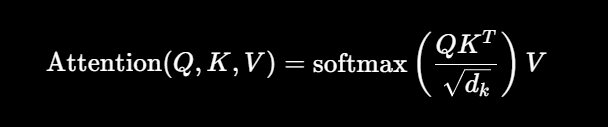

1. Self-Attention：Q、K、V来自同一个输入序列 X (讲的是什么类型的注意力权重)
Q=X*WQ  K=X*WK  V=X*WV
**序列内部关注自己**

2. Cross-Attention:Q、K、V 不是来自同一个序列
例如机器翻译：
正在生成的中文 → Q
英文原文编码结果 → K、V
**一个序列去关注另一个序列**

3. 缩放点积Attention:讲的是怎么计算注意力权重,拿到 Q、K、V 后怎么算

4. 单头 Attention
只有一套：WQ,WK,WV
	​
所以只有：Q=X*WQ K=X*WK V=X*WV
然后得到一套注意力权重

**单头Atention决定只有一套WQ,WK,WV->Self-Attention决定Q,K,V只由同一个X决定->缩放点积Attention决定如何计算Attention**